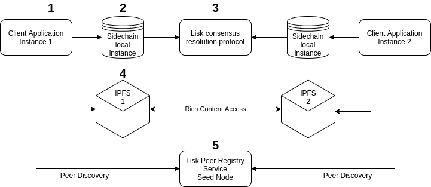
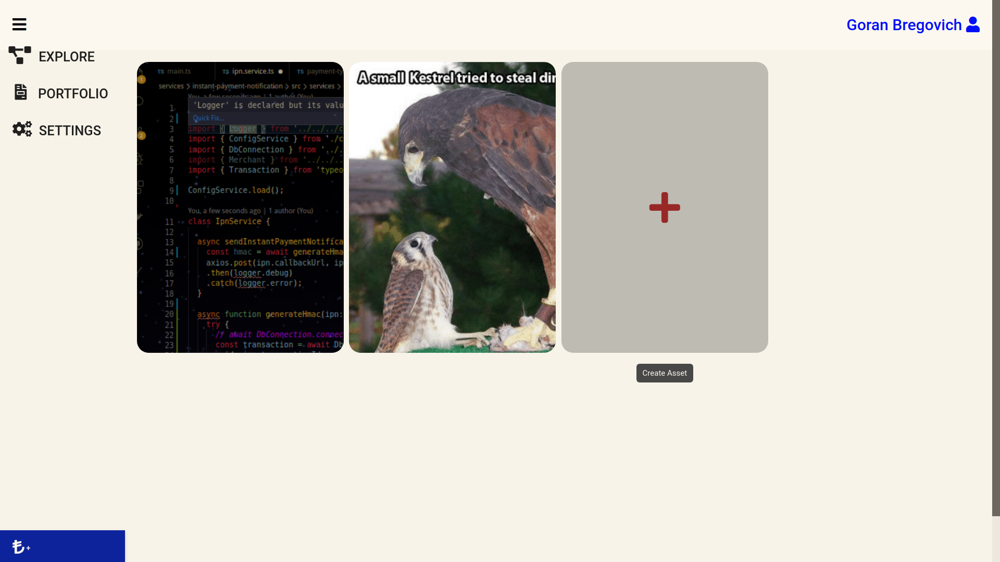

\fontsize{12pt}{20pt}\selectfont
\setlength\parindent{24pt}

\begin{center}

  \includegraphics[width=0.3\textwidth]{images/Logo_ASE.png}

  Academia de Studii Economice din București\\
  Facultatea de Cibernetică, Statistică și Informatică Economică\\
  Specializarea Informatică Economică
  \vspace*{1cm}
  

  \Large
  \textbf{Platformă Speculativă de\\ cripto-active generate ad hoc}

  \normalsize
  \vspace{0.5cm}
  Lucrare de Licență
      
  \vspace{1.5cm}

  \vfill
      
  \begin{flushleft}
  \textbf{Coordonator Științific:} \hfill \textbf{Absolvent:}\\
  dr. Vințe Claudiu \hfill Petroschi Matei
  \end{flushleft}

  \vspace{5cm}

  București\\
  2020
        
\end{center}

\clearpage

\renewcommand*\contentsname{Cuprins}
\tableofcontents
\clearpage

\begin{center}
\section{Abstract}
\end{center}
\

Lucrarea curentă descrie intreg procesul de funcționare al unei platforme de tranzacționare de cripto-active valorificate printr-un sistem blockchain folosit de o rețea distribuită de clienți conectați direct între ei. Lucrarea încearcă să demonstreze cum valoarea reală și cuantificabilă poate fi atribuită oricărei bucăți specifice de informație arbitrară indiferent de natura ei și că acea valoare este transferabilă între entități corelată perfect cu conținutul transferat.

Un obiectiv secundar este cel de arăta procesul de dezvoltare a unui sistem descentralizat în paradigma *Web 3.0* autosuficient care este intrinsec rezistent cenzurii si entropiei generale prin independența față de o entitate centrală oarecare care controlează și facilitează sistemul.

\clearpage

\begin{center}
\section{Introducere}
\end{center}
\

Menirea platformei este să permită oricărui participant să încare conținut informatic arbitrar (e.g. imagini, videouri, clipuri audio, text etc.) într-o rețea descentralizată în care aceste bucăți de conținut informatic să poată să aibă valoare recunoscută de ceilalți participanți.\
\indent În momentul încarcării utilizatorii vor putea să declare două lucruri fundamentale despre activul pe care îl creează:

  - Numarul de unități finite de activ care există și pot fi tranzacționate
  - Valoarea inițială per unitate exprimată în *cripto-monedă* (LSK)

Rezultatul final este un activ împărțit într-un număr fixat de copii unice care acum se află în portofoliul utilizatorului. Acesta poate mai departe să creeze oferte de vănzare pentru căteva sau toate instanțele din activul respectiv, iar participanții la piață vor decide dacă valoare atribuită inițial conținutului este corelată precis și în caz pozitiv vor alege să cumpere activul respectiv.\
\indent În cel mai practic sens acest activ generat de către utilizator devine în final un *Store of Value* [@def-sov] transferabil în interiorul sistemului.

Un obiectiv secundar al platformei în sine este și transferul de proprietate intelectuală de la un participant la altul cu aplicabilitate legală și în exteriorul sistemului în condițiile în care proprietarul inițial în interiorul platformei este proprietarul sau creatorul original al conținutului și în exteriorul platformei.

\clearpage

\begin{center}
\section{Capitolul 1: Istorie și mediul curent}
\end{center}
\

## Contextul Tehnologic

Evolutia tehnologiei relevante contextului modern în care toate unitățile computaționale sunt interconectate este marcată de trei paradigme importante: Web 1.0, Web 2.0 și Web 3.0.

### Web 1.0

Web 1.0 se refera la primul stadiu al evoluției *World Wide Web*. În vremurile astea erau puțini creatori cu o majoritate de utilizatori care consumau conținut. Pagini Web personale erau comune și erau reprezentate în principal de pagini statice hostate pe webservere facilitate direct de către ISP-uri (Internet Service Provider), prin alte servicii de hostare web sau chiar direct pe o mașină deținută de creator.

Un fel de a vedea web-ul în timpul acela era ca un simplu CDN (Content Delivery Network) care permitea utilizatorilor să consume o bucată de conținut și atăt.

Patru elemente de design esențial al unui site Web 1.0 includ:

- Pagini statice
- Conținut servit direct de pe *file system*-ul serverului
- Pagini construite folosind *SSI* [@ssi] sau *CGI* [@cgi]
- Tabelele și Ramele erau folosite pentru poziționarea și aliniarea elementelor în pagină

[@web-x par. 1]

Modelele de monetizare folosite în vremea asta, dacă există, sunt primitive și specifice fiecăruia, nu există servicii comune de monetizare sofisticate.

\clearpage

### Web 2.0

*Web 2.0* e paradigma care a dat naștere internetului și aplicațiilor în felul în care le cunoaștem în ziua de astăzi. O poreclă pentru *Web 2.0* este *The participative social web*. Această perioadă e caracteristică facilizării interacțiunii între utilizatori prin platforme sociale robuste care permit persistența acțiunilor, dar mai important decât asta este normalizarea interacțiunilor intre servicii și standardizarea consumului și controlului datelor. 
[@web-x par. 2]

În această perioadă se popularizează conceptul de *Application Programming Interface* (API) care prin *Data Interchange Formats* comune pot deschide accesul oricui la izvoare aproape nelimitate de date brute care pot fi manipulate în varii scopuri nepredeterminate.

Browserele Web evoluează să permită utilizarea de metodologii precum *Asynchornous JavaScript and XML* [@ajax] care permit unei pagini web să ceară date de la servicii externe fără să blocheze întreg procesul și șă aștepte rezultatul asincron, lucru care determină dezvoltarea *Framework*-urilor complexe JavaScript și în final dezvoltării de aplicații web dinamice care nu mai sunt dependente de server pentru generarea paginilor. Se trece de la *Multi Page Applications* la *Single Page Applications* (SPA) unde clientul încarcă conținutul static și codul sursă al aplicației, iar conținutul dinamic este cerut doar în momentul în care este consumat.

Cinci caracteristici tehnologice importante ale *Web 2.0* sunt:

- Organizarea, clasificarea și consumarea liberă a informației în manieră colectivă
- Conținut dinamic
- Utilizarea de API-uri externe
- Applicații *responsive* de *social media*
- Interactivitatea

Pe lăngă dezvoltările tehnologice ale vremii la fel de importante au fost dezvoltările în modelele de business și vectorii de monetizare. Putem în sfărșit să vedem o serie de modele de monetizare standardizate și servicii externe care facilitează procesul de monetizare:

- Targeted Advertising via Google Ads (aka AdWords)
- Crowdfunding via servicii precum Kickstarter sau Indigogo pentru generarea de fonduri inițiale și Patreon pentru donări recurente direct către firme și creatori
- Plată directă prin transfer bancar sau printr-un serviciu ca PayPal sau Stripe cu modele de business precum (Pay2Play sau Free2Play) pentru accesarea unui bun sau serviciu sau pentru efectuarea tranzacțiilor între terțe părți pe platforme cu această menire
- *Data Mining*-ul devine prolific ca manieră de a monetiza activitatea utilizatorilor prin tracking efectuat la nivel meta între toate site-urile și aplicațiile web folosite de utilizatori;
Site-urile participă voluntar în piața de date brute punănd *cookie*-uri care permit identificarea utilizatorilor șî raportarea către Brokeri de Date care remunerează datele culese
- Brokerii de Date agregă date de la toate site-urile și aplicațiile web care participă în procesul de *data mining* pentru a le vinde în variantă brută sau prelucrată deja în profile psihologice mai departe în principal, dar non-exclusiv, la firme de marketing care îsi adaptează strategiile și la servicii precum Google Ads pentru a arăta reclame de interes pentru fiecare utilizator în parte

Toate acestea au dus la sporirea dezvoltării de aplicații web și site-uri într-o lume post *Dot-com bubble* și la resurgența creatorilor independenți care ajung să fie în sine motorul economiei Web.

### Web 3.0 

*Web 3.0* este cel mai recent val tehnologic care încă este în procesul de definire. Aflându-ne încă în mijlocul evenimentului elementele caracteristice sunt încă în discuție, nu o să avem un răspuns clar a ceea ce va reprezenta noua paradigmă pană în momentul cristalizării. Există multă suprapunere cu penultimul val al cărui caracteristici apar parțial și în definițiile celui curent. 

Dat fiind că multe dintre elementele *Web 2.0* vor fi rădăcinile pentru multiplele mutații în diferitele directii pe care le va lua acest val acest lucru nu e surprinzător, astfel încât diferențierea se va face pe de-o parte la nivel de nuanță în abordare și implicații sociale, politice și economice.

O serie de caracterstici populare sunt:

- *Semantic Web*, ideea de dezvoltare a soluțiilor într-o manieră care permite interacțiunea la nivel semantic cu informația
- Prolifierea Inteligenței Artificiale în sistemele care croiesc colecția de conținut pe care o consumă utilizatorul în sine folosindu-se de *folksnonomia* creeată prin utilizarea organică a aplicațiilor chiar de către utilizatori
- WebAssembly
- Omniprezența datelor și a tehnologiilor Web în toate dispozitivele

>``I have a dream for the Web [in which computers] become capable of analyzing all the data on the Web – the content, links, and transactions between people and computers. A “Semantic Web”, which makes this possible, has yet to emerge, but when it does, the day-to-day mechanisms of trade, bureaucracy, and our daily lives will be handled by machines talking to machines. The “intelligent agents” people have touted for ages will finally materialize.''

> `r tufte::quote_footer('--- Sir Tim Berners-Lee')`

Dar pe lângă cele menționate mai sus este discutabil faptul că cea mai importantă caracteristică a valului *Web 3.0* și cea care va fi amintită de istorie în viitor ca fiind determinantă pentru această perioadă va fi prolifierea conceptului de *Descentralized Application* (dApp), mișcarea către a dezvolta aplicații într-o arhitectură descentralizată bazată pe implementări *Blockchain*.

Crypto-monedele au reprezentat prima implementare a tehnologiei *Blockchain* care au popularizat conceptul și au dovedit că infrastructura modernă poate în sfârșit șă-l suporte, în schimb lucrurile nu se termină aici.

Blockchain este o formă de bază de date distribuită și descentralizată care printr-un mecanism de rezoluție a consensului între agenții participanți poate să garanteze intrinsec identitatea, validitatea și imutabilitatea operațiunilor pe care le înscrie și replică pe toate dispozitivele participante.

Un *dApp* este un tip de applicație care la suprafață funcționează la fel ca oricare alta, dar nu este dependentă de niciun server central, conexiunile dintre client și rețea fiind de tip Peer-to-Peer, conținutul persistent dinamic fiind reținut în blockchain-ul comun tuturor nodurilor din rețea.

La finalul erei *Web 2.0* deja devenau evidente anumite probleme cu felul în care se face business-ul pe web. Principalele fiind:

- Consolidarea tuturor resurselor informatice într-un număr foarte redus de servicii monolit deținute de agenți economici cu prea multă putere
- Lipsa de autoritate asupra informației publicate pe servicii în sensul in care deși proprietatea intelectuală a unui creator îi aparține, orice firmă are puterea de a controla dacă acea proprietate este accesibilă sau nu pe platforma respectivă
- Cenzura selectivă după discreția firmelor și manipularea trendurilor
- Colectarea clandestină de date fără remunerarea utilizatorilor

În ultimii 3-4 ani eforturile oamenilor concentrați pe problemele menționate mai sus s-au manifestat în direcția eliminării complete la nivel arhitectural a oricărei entități centrale care să poată să controleze conținutul, dând înapoi puterea cibernetică utilizatorilor care acum vor avea să fie atât clientul căt și serviciul în sine.

O altă problemă evidentă a lumii vechi este dependența față de *advertising* ca vector financiar principal. Cănd au început să devină populare soluții precum AdBlock, apăruseră atăt în răndul creatorilor căt și al firmelor frici legate de sustenabilitatea modelului economic web și dacă procesul poate să continue. 

Golul lăsat de *ads*-urile în minus a fost din fericire umplută de soluțiile de crowdfunding care au apărut, lucru care a fost benefic din multe puncte de vedere, nu cel din urmă fiind faptul că acum tabla de joc începe să dea semne de normalizare a distribuției de valoare asupra conținutului informatic creeat doar prin simplul fapt că acum oamenii pot să aleagă voluntar pe cine să plătească după gust, lucru care a creeat o formă de clasă de mijloc între creatorii de pe internet.

*Web 3.0* construiește mai departe pe conceptul de crowdfunding și vine și cu soluții noi. Brave este un browser lansat în 2019 care include nativ toate facilitățile necesare pentru funcționarea dApp-urilor, el în sine fiind un dApp cu propriul lui sistem *Blockchain* cu cripto-monedă.
Brave va permite tuturor dApp-urilor care se integrează cu standardul prezent să primească bani direct de la utilizatorii care vor să plătească cu crypto-moneda brave într-un mod foarte intuitiv direct din browser.

Cănd vine vorba de locul *advertising*-ului în lumea *Web 3.0*, avănd în vedere că deja browser-ele încep să blocheze *ads*-urile implicit este destul de clar că nu vor mai fi la fel de intrusive și lumea va continua trendul către alte modele de monetizare. Chiar și așa ele nu vor dispărea complet, o altă funcționalitate a browser-ului Brave este vizualizarea voluntară remunerată a *ads*-urilor, modelul de *advertising* devenind mai sofisticat prin faptul că acum utilizatorul trebuie luat în calculul marginilor financiare împarțite pe lăngă serviciul care ține *ads*-urile în discuție și evident *advertiserul* care deține *ads*-urile și contractele cu firmele ale căror produse și servicii sunt prezentate. Utilizatorii finali vor trebui insentivați direct să consume ca să participe voluntar în orice mecanism de monetizare, duse sunt zilele suportului involuntar.

Acesta este contextul tehnologic în care a fost dezvoltată aplicația prezentată mai departe în această lucrare.

## Contextul Politic

Dat fiind gradul de consolidare mediatică din prezent devine din ce în ce mai evident că infrastructura curentă este prea vulnerabilă controlului de către firmele care dețin platformele folosite de populație și de către actori statali care influențează direcția discursului politic digital prin mecanisme externe platformelor în sine. În alte cuvinte este aparent faptul că fluxul informatic este prea ușor influențat de legile și ordonanțele statelor lumii și a moderării draconice efectuate de firme pentru a limita selectiv accesul la informație.

Lucrarea de față invocă anumite presupoziții filosofice în sensul ăsta:

1. Într-o lume *post-adevăr* gradul de entropie informațională trebuie mărit, nu micșorat
2. Heterogenitatea naturii entităților care pot să impacteze semnificativ cursul informatic trebuie maximizată
3. Orice agent economic sau actor statal trebuie să subscrie aceluiaș set de reguli ca oricare alt subset de indivizi care participă colectiv la producerea conținutului, altfel spus *software*-ul trebuie construit în așa fel încăt să nu poată fi controlat prin alte maniere în afară de propriile lui mecanisme organice interne

În momentul scrierii lucrării, în mijlocul pandemiei COVID-19, Congresul american dezbate *Eliminating Abusive and Rampant Neglect of Interactive Technologies (“EARN IT”) Act*, care urmăreșțe să încarce firmele private cu mai multă responsabilitate legală de a preveni utilizatorii din a încărca material ilegal, în specific legat de prostituție. Legea nu face distincție între canale publice și private în interiorul unei aplicații avănd ca potențial rezultat forțarea firmelor să creeze *backdoor*-uri sau să renunțe complet la sistemele lor de end-to-end encryption pe care le folosesc utilizatorii lor pentru a putea să monitorizeze activitatea în întregime pentru a o modera.
[@earn-it]

Combinația cu *European Union Directive on Copyright in the Digital Single Market* care includea infamul *Articol 13* care responsabilizează legal firmele să prevină încărcarea ilegală de proprietate intelectuală face ca firmele să fie obligate să implementeze măsuri draconice de control informatic pe lăngă cele pe care chiar ele ar fi vrut să le implementeze, lucru care are ca potențial rezultat un grad de sterilitate informatică contraproductiv presupunerilor menționate mai sus. [@article-13]

\clearpage

Scopul acestei secțiuni nu este menit activismului politic, în schimb este de a prezenta o secțiune verticală a motorului ideologic care conduce eforturile de reconstrucție infrastructurală și arhitecturală avănd ca unul dintre obiectivele centrale libertatea și autodeterminarea informatică.

\clearpage

\begin{center}
\section{Arhitectura Software}
\end{center}
\



1. Applicație Angular 2+ folosită pentru interacțiunea la nivel de peer cu rețeaua sistemului, folosită de utilizatorul final pentru a creea, vinde și cumpăra crypto-active
2. Instața locală a *sidechain*-ului Lisk în care se înregistrează informațiile despre crypto-active, date despre utilizator și în cazul OrderBroker-ului validarea unui ordin de vânzare spre a fi transferat efectiv
3. Protocolul de consens este procesul prin care toate adăugirile la blockchain sunt agregate, validate și propagate înapoi în rețea ca noua versiune de blockchain comuna tuturor nodurilor
4. Instața de IPFS (InterplanetaryFileSystem) prin care se stochează local conținutul bogat corelat cu crypto-activul creeat de utilizator și îl expune la internet
5. Componenta din Lisk care deservește drept *Seed Peer* și înregistrează nodurile conectate
(Singura componentă centrală din arhitectură)

\clearpage


\clearpage

## Descrierea funcțiilor principale

#### Login
\
În comparație cu aplicațiile normale, acest tip de aplicație nu necesită un proces separat de înregistrare, în momentul primei utilizări, utilizatorul poate să genereze pe pagina de login *passphrase*-ul unic cu care se va identifica de acum în colo.\
Exemplu de *passphrase*:
```
horn future wife theme inherit ice buffalo drop chimney forum boss educate
```

Acest *passphrase* este spart de modulul `@liskhq/lisk-cryptography` în perechea de chei unice asociate utilizatorului care sunt folosite pentru autorizarea tuturor acțiunilor legate de utilizatorul respectiv.

Nimic altceva nu este necesar în afară de acest *passphrase* care trebuie ținut minte de utilizator și nu va putea niciodată fi schimbat fără a pierde întreagă activitatea din sistem.

În cel mai practic sens 'contul' utilizatorului este creeat de abia în momentul în care se înregistrează prima tranzacție cu adresa și cheia publică expusă în blockchain fie că există date asociate sau e o transacție nulă.

#### Creearea de crypto-active
\
Pe pagina cu portofoliul utilizatorului acesta este capabil să creeze un crypto-activ cu printr-un modal în care poate să introducă datele relevante și să încarce conținutul bogat asociat activului respectiv.

Conținutul bogat poate să fie de orice natură (text, photo, video, audio etc.) și în momentul încărcării pe platformă este de fapt înregistrat pe instața locală de IPFS pentru a fi expus internetului.
În momentul în care cineva vizualizează crypto-activul de pe alt dispozitiv acela este de abia momentul când conținutul este citit de pe dispozitivul origine și *cache*-uit pe dispozitivul consumator.

#### Vânzarea și cumpărarea de cripto-active

Principala activitate realizată pe platformă este cea de vânzare și cumpărare de cripto-active generate de utilizator. Acest lucru se realizează descentralizat prin intermediul unui cont virtual terță parte care înregistrează toate tranzacțiile de pe platformă. Rezultatul final este o logică transacțională de tip *escrow* pentru a asigura securitatea tranzacțiilor între participanții la piață prin care cripto-activul este mutat în posesia contului terț până în momentul în care un participant este capabil să satisfacă condițiile tranzacției.

\clearpage

\begin{center}
\section{Tehnologii utilizate}
\end{center}
\

Dată fiind amploarea proiectului colecția de tehnologii utilizate pentru atingerea fiecărui obiectiv este relativ largă:

## Angular 2+ 

Framework-ul de frontend utilizat pentru realizarea componentei interactive a proiectului,
Angular 2+ este un framework SPA (Single Page Application) care funcționează pe bază de componentă.

Componentele în Angular sunt făcute în așa fel încât să fie bucăți modulare care conțin atât elementele necesare pentru stilizare cât și codul sursă care va fi să fie executat în relație cu componenta respectivă și componentele înconjurătoare. 
Ele pot fi creeate într-o formă cât de atomică sau complexă este nevoie astfel încât să poată fi folosite ca orice tip de element de UI autoconținut în interiorul unui șablon HTML dinamic.

Angular 2+ este gândit în jurul unui pattern arhitectural la nivel de aplicație cunoscut în accepțiunea comună curentă sub denumirea de MVW (Model-View-Whatever, Where Whatever stands for "whatever works for you"). În perioada de tranziție între Angular.js șî Angular 2+ era pusă în discuție de către comunitate clasificarea lui Angular ca framework într-una dintre *pattern*-urile următoare:

- MVC\ \ \ \ (Model-View-Controller)
- MVVM (Model-View-ViewModel)
- MVP\ \ \ \ (Model-View-Prezenter)

În final dat fiind faptul că important era partea comună între aceste *pattern*-uri și anume ideea de decuplare a *View*-ului (Partea structurală și stilistică), Model (Structura de date arbitrară asociată *View*-ului) și logica efectivă, eticheta de MVW a devenit un descriptor popular.
Folosirea componentelor reutilizabile făcute accesibile prin sistemul de dependency injection în combinație cu o multitudine de feluri în care se poate obține *data-binding* între elementele din *View* Și model determină o practică mai scalabilă în comparație cu oricare dintre *pattern*-urile vechi privite izolat.

Angular 2+ vine cu o suită de abstracții fundamentale care fluidizează procesul de dezvoltare dramatic, printre ele numărându-se și sistemul robust de routing și HttpClient-ul puse la dispoziție.

## NestJS
\
NestJS este un framework de *backend* care a fost dezvoltat de la început să fie foarte similar cu Angular dată fiind popularitatea percepută și scalabilitatea efectivă a *pattern*-ului arhitectural implementat.

Aceleași principii de design din Angular se aplică și în NestJS lucru care facilitează un proces de dezvoltare în oglindă între porțiunea de *frontend* și *backend*, iar sistemul de *dependency injection* și *design pattern*-urile native precum *Interceptor*, *Guard* și *Factory* au ajuns să fie standard și în lumea *backend*-ului bazat pe Node.js.

NestJS folosește Express ca motor de abstracție HTTP implicit, dar poate fi înlocuit cu Fastify.

Ambele *framework*-uri folosesc TypeScript ca limbaj de programare efectiv.

#### Node.js
\
Node.js este un *runtime environment* de JavaScript care folosește motorul V8 original creeat și menținut de Google și implementează standardul ECMA.

#### TypeScript 
\
Este un superset de JavaScript care este transpilat de *TypeScript Compiler* în orice versiune de  JavaScript și poate să fie rulat în aceleași condiții.
\
TypeScript a fost creeat pentru a ameliora problemele care au apărut în evolutia limbajului pe care se bazează în lunga lui istorie plină de evenimente care au cerut noi funcționalități pentru care nu fusese inițial menit.

#### Express
\
Este un *framework* de abstracție HTTP bazat pe sistemtul de server și socket nativ Node.js.

\clearpage

## Lisk

Lisk este un sistem de blockchain construit pe Node.js care manifestă o funcționare foarte performantă în comparație cu majoritatea soluțiilor de pe piață și a fost construit de încă de la început cu obiectivul de a servi drept o platformă largă pe care să se integreze *dApp*-uri care să se folosească de *Mainnet* pentru a vira valoare reală în interiorul rețelei lor private respective și ca framwork de *sidechain*-uri cu propria logică de proprietate.

În comparație cu Ethereum, cel mai mare sistem *blockchain* care e menit dezvoltării *dApp*-urilor, Lisk este construit în întregime folosind JavaScript executat pe Node.js și își concentrează filosofia de dezvoltare pe conceptul de tranzacții personalizate în pofida unui limbaj propriu precum Solidity și a conceptului de *smart contract* și folosește PostgreSQL ca bază de date pentru menținerea persistenței locale a *blockchain*-ului.

Această configurație garantează un prag de cunoaștere necesar pentru lucrul cu sistemul Lisk foarte scăzut și permite un volum potențial mai mare de ingineri care pot să înceapă imediat să construiască *dApp*-uri fără a pierde timpul învâțând un limbaj nou de programare sau un sistem de gestionare ale bazelor de date nou. Proiectul Lisk a putut să ajungă în starea în care este astăzi de stabilitate atât la nivel tehnic cât și la nivel de securitate financiară pentru că încă de la început a putut să se folosească de inerția și bogăția tehnologică a ecosistemului Node.js, fapt ce a determinat o evolutie foarte agresivă într-un timp foarte scurt.

### Sidechains

![Sidechains [@lisk-article-1]\label{fig-3}](images/Sidechains.jpeg)

Lisk permite dezvoltarea de *dApp*-uri independente care pot să efectueze operațiuni arbitrare personalizate după discreția inginerilor participanți folosind ideea de *Sidechain*.

\clearpage

Un *sidechain* este o instană independentă de blockchain compatibilă la nivel fundamental cu *mainchain*-ul Lisk. Faptul că *dApp*-urile folosesc *sidechain*-uri proprii pentru operațiunile care necesită logică proprie are mai multe avantaje în comparație cu alte sisteme  ale căror aplicații conectate trebuie toate să utilizeze același *blockchain* comun în aceeași rețea printre care și:

- Abilitatea de a creea tranzacții personalizate care nu trebuie să respecte standarde predefinite comun de comunitate
- *Mainnet*-ul fiind complet separat nu este încărcat suplimentar nici la nivel de rețea și nici la nivel de informație irelevantă pentru majoritatea participanților care trebuie stocată
- Inginerii pot să vină cu soluții ineficiente fără să afecteze negativ performanța sistemului întreg

### Delegatated Proof of Stake

*Delegated Proof of Stake* sau DPoS este protocolul de rezoluție a consensului folosit de proiectul Lisk și este lucrul care a permis atingerea performanței ridicate manifestată în prezent.

Metrica principală de performanță pentru sistemele *blockchain* este *block time*, timpul necesar pentru ca un set de tranzacții să fie agregate și validate de protocolul de consens pentru a fi înscrise ca un nou *block* în *blockchain*.

Pentru comparație:

- Bitcoin block time: ~10min [@block-time]
- Ethereum block time: ~20s  [@block-time]
- Lisk block time: ~10s

Majoritatea sistemelor de până acum foloseau mecanisme de consens de tip *Proof of Work* sau PoW, care necesită rezolvarea unei probleme cryptografice complexe pentru a da dreptul unui nod din rețea să înscrie un *block* nou în blockchain, acest lucru înseamnă că un mecanism de acest tip va necesita mereu putere computațională relativă foarte ridicată cu un consum real de energie electrică corelat și deci cu costuri foarte mari asociate, iar *block time*-ul va fi foarte lung.
Acest procest mai este cunoscut și sub numele de *mining*.

*Proof of Stake* sau PoS este cea mai comună alternativă pentru PoW. Sistemele de tip PoS au fost dezboltate să rezolve o parte dintre ineficiențele și problemele care reies din mecanismul PoW.
În contextul sistemelor de tip PoS nu se mai discută de *mining* în sensul vechi, securizarea versiunii fiind deterministă prin faptul că nodul care înscrie noul *block* este ales în baza cantităților de crypto-monedă pe care le pun la dispoziție participanții, unde cei ce dispun mai mult au șanse mai mari să fie aleși.
Procesul prin care nodul din rețea ales înscrie noul *block* este cunoscut ca *forging*. 

Este considerat de asemenea că acest mecanism este potențial mai rezistent la *51% attacks* deoarece un agent rău intenționat trebuie să aibă în proprietatea lui cel puțin 51% din cantitatea totală de crypto-monedă de pe piață și eșecul atacului implică pierderi financiare imense.

*Delegated Proof of Stake* sau DPoS este un algoritm de conses dezvoltat de Daniel Larimer în 2014  prin care participanții votează pentru alegerea delegațiilor care securizează rețeaua în locul lor.  Delegații, cunoscuți și sub denumirea de martori, sunt responsabili pentru atingerea consensului în timpul generării și validării noilor *block*-uri. Puterea votului este proporțională cu cantitatea de crypto-monedă deținută.

![Elecția Delegațiilor [@lisk-article-2]\label{fig-4}](images/lisk-voting.png)

\clearpage

În prezent numărul de delegați este fixat la 101, dar acest număr va fi mărit în viitor.

![Propoția Elecției [@lisk-article-2]\label{fig-5}](images/lisk-proportional-voting.png)

## IPFS

*Interplanetary File System* sau IPFS este un protocol de rețea peer-to-peer pentru stocarea și diseminarea datelor de orice natură într-un sistem de fișiere distribuit folosind principiul de *content-addressing* pentru a identifica unic fiecare fișier într-un *namespace* global care conectează toate dispozitivele participante.

IPFS este construit în jurul unui sistem descentralizat de utilizatori operatori care dețin o porțiune din toate datele stocate în rețea, astfel creeând un sistem rezilient de stocare și disminare de fișiere. Orice utilizator din rețea poate să servească un fișier și oricare alt utilizator poate să acceseze fișierul respectiv în rețea prin adresa de conținut care este regăsită folosind un *Distributed Hash Table* sau DHT.

IPFS devine unul dintre subsistemele majore ale internetului și dacă este construit și împlementat cum trebuie în timp poate să complementeze sau chiar să înlocuiască HTTP. Obiectivul principal al proiectului este să elimine dependența față de *backbone*-ul internetului pentru a creea o infrastructură complet descentralizată și rezilientă care să nu piardă informație pentru că unul dintre sistemele centrale care ține o bucată de conținut pică.

\begin{center}
\includegraphics[width=0.5\textwidth]{images/ipfs-illustration-centralized.png}
\end{center}

### Perspective

Acest sistem poate fi privit în mai multe chei:

IPFS ca protocol:

- Definește un sistem de fișiere adresabil prin hash-ul conținutului efectiv 
- Coordonează livrarea conținutului
- Combină conceptual Kademlia + BitTorrent + Git

IPFS ca sistem de fișiere:

- Are directoare și fișiere
- Este montabil la alte sisteme de fișiere via FUSE (*FileSystem in Userspace*)

IPFS ca sistem web:

- Poate fi folosit pentru a consuma documente ca web-ul convențional
- Fișierele sunt accesibile via HTTP prin gateway-uri publice sau private care fac conversia între protocolul standard HTTP și IPFS
- Poate fi folosit pentru a hosta și disemina aplicații statice
- Browserele pot fi extinse pentru a suporta protocolul via ipfs-companion
- Garantează autenticitatea conținutului prin addresarea bazată pe hash-uri

IPFS ca CDN (Content Delivery Network):

- Un fișier adăugat în nodul local este accesibil la nivel mondial
- Implementează un sistem de distribuție de lățime de bandă ca BitTorrent
- Aplică caching în puncte critice sau local pentru a permite conținutului să fie accesibil mai rapid la a doua descărcare

\clearpage

### Crypto-adresare

IPFS se folosețe de conceptul de *Merkle Directed Acyclic Graphs* sau *MerkleDAG* ca să adreseze criptografic fișierele. Un MerkleDAG este un sistem criptografic prin care *hash*-urile 'părinte' își modifică signatura în baza *hash*-urilor 'copil' rezultatul fiind o structură arborescentă care poate să fie parcursă într-o manieră scalabilă.

![DAG Filesystem [@ipfs-article-1]\label{fig-6}](images/dag-structure.jpeg)

Din exemplul de mai sus conținutul fișierului *my_file.txt* poate să fie adresat în două moduri:

- Fie direct prin *Content Identifier*-ul sau CID-ul lui propriu

```
#!/bin/sh
ipfs cat QmfM2r8seH2GiRaC4esTjeraXEachRt8ZsSeGaWTPLyMoG
#Result: Hello World!
```

- Ori prin CID-ul unui director arbitrar cu *path*-ul relativ concatenat la final

```
#!/bin/sh
ipfs cat Qma3qbWDGJc6he3syLUTaRkJD3vAq1k5569tNMbUtjAZjf/my_dir/my_file.txt
#Result: Hello World!
```

\clearpage

\begin{center}
\section{Implementarea soluției}
\end{center}
\

Cum a fost descris în introducere, aplicația prezentată permite utilizatorului să creeze cripto-active care pot fi valorificate speculativ în interiorul rețelei.


Poate să introducă *passphrase*-ul lui personal pentru a intra în aplicațîe cu contul lor asociat sau pot să genereze un passphrase nou dacă nu au mai folosit aplicația până acum.

După logare utilizatorul poate să intre pe pagina portofoliului lor personal și de acolo au posibilitatea să creeze, modifice, distrugă crypto-active sau să creeze oferte de vânzare cu ele. 

Pe pagina de explorare utilizatorul poate să vadă toate ofertele de vânzare de cripto-activ valabile pe platformă.


 




\clearpage

\begin{center}
\section{Fluxul de Valoare}
\end{center}

![Lisk Protocol Roadmap [@lisk-roadmap]](images/ibc.png)

Momentan Lisk de abia a ieșit din stadiul de Alpha și nu are toate funcționalitățile necesare pentru a completa întreg procesul necesar pentru introducerea de valoare în interiorul pieței descrise în lucrarea prezetă, în schimb acestea sunt planificate, iar având în vedere progresul constant pe care l-a manifestat Lisk ca organizațîe în decursul a patru ani este legitim presupus că nu o să lase proiectul să moară.

Fluxul general de valoare pe care îl va avea *dApp*-ul va fi acesta:


\clearpage

<!-- \begin{center}
\section{Strategii de desfășurare}
\end{center}

\clearpage -->

\begin{center}
\section{Concluzii}
\end{center}

Platforma a fost inițial planificată ca o piață liberă de conținut a cărui valoare este securizată de mecanismele intrinseci unui sistem blockchain. Potențialul platformei este mai larg de atât. 

Platforma în starea curentă este capabilă de distribuire informațională complet descentralizată. Toate componentele necesare funcționării apicației ca nod în rețea sunt cuprinse într-un singur pachet distribuibil într-o formă ușor de instalat pe orice dispozitiv uzual, iar acesta va fi singurul lucru pe care un prospectiv participant îl va trebui face pentru a deveni un nod în rețea și a participa pe platformă. Toate nodurile din rețea au aceleași drepturi la nivel de logică relevantă platformei, nu există noduri speciale care să aibă mai mult control asupra proceselor specificate, nici măcar creatorul platformei nu va avea mai multe drepturi decât utilizatorul normal.

Într-o lume în care oligopolul companiilor care dețin puținele aplicații sociale, care au ajuns să reprezinte surse primare de informație pentru mare parte din public, tinde să se manifeste prin cenzură selectivă și colectare clandistină de date fie prin propria lor voință sau împinse de forțele coercitive ale statelor lumii, foamea de transparență, anonimitate și independență creșțe în zeitgeistul contemporan pe zi ce trece.

Aplicația prezentată poate să fie ușor extinsă pentru a cuprinde toate funcționalitățiile tuturor *site*-urilor și aplicațiilor pe care le folosește publicul în mod uzual, iar faptul că acest lucru se poate realiza fără niciun cost de mentenanță pentru complexul de servere mari care trebuie să conțină toată informația distribuită pe platformă face ca acest lucru să fie mai mult decât facil.
Costul este distribuit uniform între utilizatori și nu există nicio entitate centrală care să fie necesară pentru a ține platforma în picioare, rețeaua întreagă având potențial de autosuficiență deplină.

În afara unei serii de evenimente dramatice care să schimbe masiv cursul istoriei, este foarte probabil că aceasta va fi direcția generală a dezvoltărilor tehnologice în cea de a treia eră Web.


\clearpage

\renewcommand*\listfigurename{Lista figurilor utilizate}
\listoffigures

\clearpage

# Bibliografie

<div id="refs"></div>

\newpage 

# Anexă

## Configurarea și inițializarea modulului Lisk

```{js, size="huge"}
import { Module, HttpModule } from '@nestjs/common';
import { LiskService } from './lisk.service';
import { LiskController } from './lisk.controller';
import { CryptoService } from './crypto.service';
import { getNetworkIdentifier } from '@liskhq/lisk-cryptography';
import { Application, genesisBlockDevnet, configDevnet } from 'lisk-sdk';
import { APIClient } from '@liskhq/lisk-api-client';
import { Logger } from '../../../common/logger';
import { AccountTransaction } from './transactions/account.transaction';
import { DEVNET_URL } from '../../../common/env_vars';
import { OrderTransaction } from './transactions/order.transaction';

configDevnet.modules.chain.forging.force = true;

genesisBlockDevnet.transactions[0] = {
  id: '7646387794267587684',
  type: 8,
  timestamp: 0,
  senderPublicKey:
  'edf5786bef965f1836b8009e2c566463d62b6edd94e9cced49c1f098c972b92b',
  signature:
  '9f1282585cf91c9da0355f8e75c53363e50c0c1d41e96756b2bda02991ecb351bf67...',
  asset: { amount: '10000000000000000', recipientId: '16313739661670634666L' }
}

export const lisknet = new APIClient(
  process.env.MAINNET ? APIClient.constants.MAINNET_NODES : 
  APIClient.constants.TESTNET_NODES
);


export const devnet = new APIClient(
  [DEVNET_URL]
);

export const networkIdentifier = getNetworkIdentifier(
  "23ce0366ef0a14a91e5fd4b1591fc880ffbef9d988ff8bebf8f3666b0c09597d",
  "Lisk",
);

@Module({
  imports: [HttpModule],
  providers: [{
      provide: 'LISK_SETUP',
      useFactory: () => {
        const app = new Application(genesisBlockDevnet, configDevnet);
        app.registerTransaction(AccountTransaction);
        app.registerTransaction(OrderTransaction);
        app
        .run()
        .then(() => console.log('Lisk Connected'))
        .catch(err => {
          console.error(err);
          process.exit(1);
        });

      }
    },
    LiskService,
    CryptoService
  ],
  controllers: [LiskController]
})
export class LiskModule {}

```

## Serviciul principal de logică tranzacțională (Snippets)

```{js}
export function timestamp() {
    const millisSinceEpoc = Date.now() - Date.parse(EPOCH_TIME.toString());
    const inSeconds = ((millisSinceEpoc) / 1000).toFixed(0);
    return  parseInt(inSeconds)-1;
}

async updateAccount(user: User) {
  const tx = new AccountTransaction({
    timestamp: timestamp(),
    networkIdentifier: networkIdentifier,
    asset: user.asset
  });
  tx.sign(user.passphrase);

  try {
    const result = await devnet.transactions.broadcast(tx.toJSON())
    log.info('Transaction result: ', result);
    return result;
  } catch(err) {
    log.error(err);
    throw new Error("Fail on update account");
  }
}

async transact(buyOrder: BuyOrder, passphrase: string, asset: Asset) {
  const tx = trans.transfer({
    amount: convertLSKToBeddows(buyOrder.offeredPrice.toString()),
    networkIdentifier: networkIdentifier,
    recipientId: buyOrder.sellerId,
    passphrase: passphrase
  });

  try {
    await devnet.transactions.broadcast(tx);
  } catch(err) {
    throw new InsufficientFunds("That wasn't very cash money of you");
  }

  try {
    await this.addAssetToUserPortfolio(asset, passphrase);
  } catch(err) {
    throw new Error("Failed to transfer asset to portfolio")
  }

  try {
    await this.removeSellOrder(buyOrder.sellOrderId);
  } catch(err) {
    throw new Error("Failed to remove sell order");
  }
  return;
}

async addSellOrder(sellOrder: SellOrder) {
  let orderAccount: OrderAccount = await this.getOrderAccount();
  let asset: Orders = orderAccount.asset;
  asset.sellOrders.push(sellOrder);

  const tx = new OrderTransaction({
    timestamp: timestamp(),
    networkIdentifier: networkIdentifier,
    targetAccountAddress: getAddressFromPassphrase(sellPass),
    asset: asset
  });
  tx.sign(sellPass);

  try {
    const result = await devnet.transactions.broadcast(tx.toJSON());
    log.info('Transaction result: ', result);
    return result;
  } catch(err) {
    log.error(err);
    return { status: 400, message: "Please try again" };
  }
}

async addBuyOrder(buyOrder: BuyOrder, passphrase: string) {
  let orderAccount: OrderAccount = await this.getOrderAccount();
  let asset: Orders = orderAccount.asset;
  asset.buyOrders.push(buyOrder);

  const relevantSellOrder = asset.sellOrders.filter((sellOrder) => sellOrder.id == buyOrder.sellOrderId)[0];

  try {
    await this.transact(buyOrder, passphrase, relevantSellOrder.assetData);
  } catch(err) {
    log.error(err);
    throw new HttpException(err.message, 400);
  }

  const tx = new OrderTransaction({
    timestamp: timestamp(),
    networkIdentifier: networkIdentifier,
    targetAccountAddress: getAddressFromPassphrase(sellPass),
    asset: asset
  });
  tx.sign(sellPass);

  try {
    const result = await devnet.transactions.broadcast(tx.toJSON());
    log.info('Transaction result: ', result);
    return result;
    ...
}

```

## Exemplu tranzacție personalizată

```{js}
export class AccountTransaction extends BaseTransaction {

  private accountAsset: any;

  protected verifyAgainstTransactions(transactions: readonly import("@liskhq/lisk-transactions").TransactionJSON[]): readonly TransactionError[] {
    throw new Error("Method not implemented.");
  }
  protected assetFromSync(raw: any): object {
    throw new Error("Method not implemented.");
  }

  constructor(transObj: TransactionInfo) {
    super(transObj);
  }

  static get TYPE() {
    return 13;
  }

  static get FEE() {
    return `0`;
  };

  async prepare(store) {
    await store.account.cache([
      {
        address: this.senderId
      },
    ]);
  }

  validateAsset() {
    const errors = [];
    const asset: any = this.asset;


    return errors;
  }

  applyAsset(store) {
    const errors = [];
    const asset: Partial<User> = this.asset;
    let sender: any = store.account.get(this.senderId);

    const newObj = { ...sender, asset: asset };
    store.account.set(sender.address, newObj);

    return errors;
  }

  undoAsset(store) {
    const sender = store.account.get(this.senderId);
    const nullAssetObj = { ...sender, asset: null };
    store.account.set(sender.address, nullAssetObj);
    return [];
  }

  assetToBytes() {
    return Buffer.from(JSON.stringify(this.asset));
  }

  assetToJSON() {
    return this.asset;
  }

}
```
